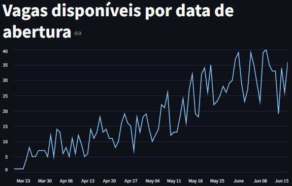
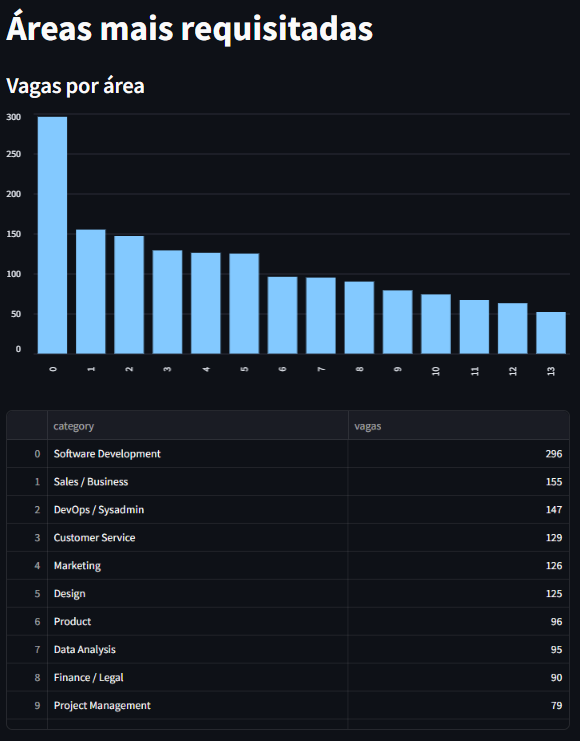
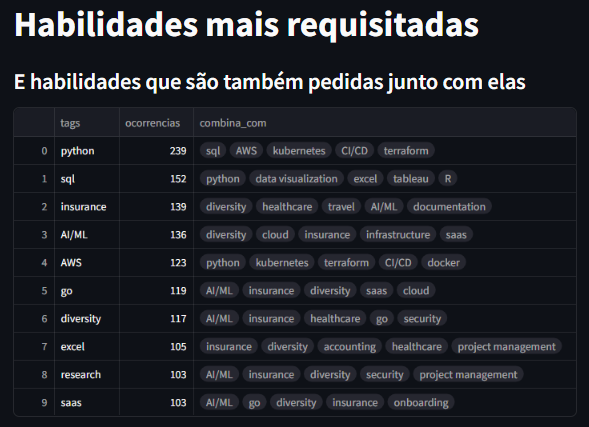
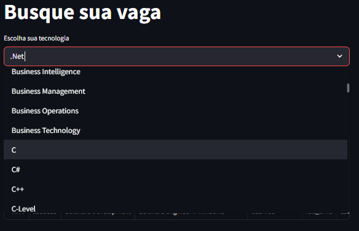
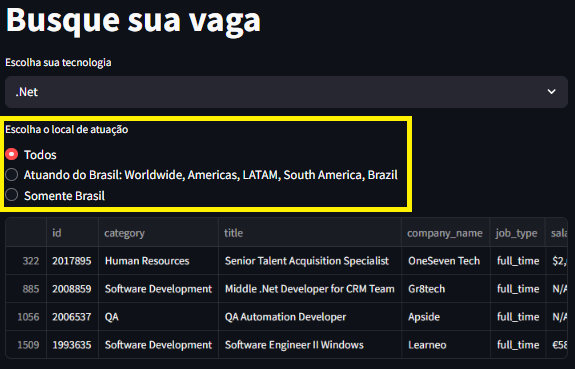
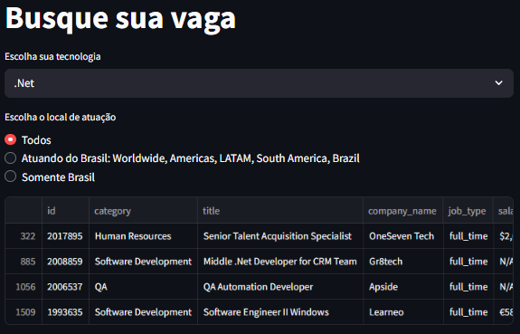

# TopLinguagens  
 
 
 
 
 
   

## Descrição

Utilizei a API do site [Remotive](https://remotive.com/) para obter os dados sobre vagas disponíveis.

Você se sente perdido tentando entender o que o mercado de tecnologia realmente pede?  
Não sabe quais linguagens estudar, quais habilidades são mais valorizadas ou o que vem além do básico?

Este projeto analisa centenas de vagas reais e responde, com dados concretos:

- Quais tecnologias estão mais em alta?  
- O que as empresas realmente esperam além da stack principal?  
- Quais combinações de habilidades aparecem com mais frequência?

---

## 1. Leitura dos dados

- Os dados são baixados por meio de uma requisição usando `requests`;
- Em seguida, o arquivo `vagas.json` é salvo localmente;

---

## 2. Organização dos dados

Como as vagas podem aceitar diferentes localizações e exigir várias tecnologias, os dados foram separados em 3 arquivos:

- `arq_vagas.parquet`: Informações gerais da vaga;  
- `arq_locais.parquet`: Localizações aceitas para cada vaga (após `explode()`);  
- `arq_tecnologias.parquet`: Requisitos técnicos de cada vaga (após `explode()`);  

---

## 3. Visualização dos dados

A visualização dos dados foi feita com Streamlit, permitindo explorar as vagas de forma interativa.

---

## CI

- A branch `main` está protegida contra `push`;  
- Utilizo a branch `develop` com `pull request`;  
- Há uma etapa de CI automatizada para validações;

---

## Taskipy

Utilizei o Taskipy para facilitar a execução de comandos comuns durante o desenvolvimento.

### Comando base:

poetry run task <nome_da_tarefa>
Tarefas disponíveis
| Tarefa | Descrição |
| --- | --- |
| lint | Executa o linter ruff para verificar problemas de formatação e estilo. |
| pre_format | Corrige automaticamente problemas detectados pelo ruff. |
| format | Aplica o estilo de formatação definido (ruff format). |
| pre_run | Executa o script main.py para processar e carregar os dados. |
| run | Inicia a aplicação com Streamlit (toplinguagens/app.py). |
| pre_test | Executa o lint automaticamente antes dos testes. |
| test | Executa os testes usando pytest em modo verboso. |

Observação: as tarefas pre_run e pre_test são chamadas automaticamente antes das tarefas run e test, respectivamente.

## Estrutura de Diretórios
<pre lang="markdown"><code>.
.
├── .github
│   └── workflows
│       └── CI.yaml
├── README.md
├── data
│   ├── arq_locais.parquet
│   ├── arq_tecnologias.parquet
│   ├── arq_vagas.parquet
│   └── vagas.json
├── poetry.lock
├── pyproject.toml
├── tests
│   └── test_vagas.py
└── toplinguagens
    ├── app.py
    ├── classes
    │   └── vagas.py
    └── loader.py
</code></pre>

## Imagens

### Vagas abertas por data  
#### A data de abertura das vagas disponíveis

### Áreas mais requisitadas 
#### Vagas por área

### Linguagens mais requisitadas  
#### Tecnologias mais pedidas e as que mais aparecem junto com elas

### Busca de vagas por filtros  

#### Filtro por requisitos/linguagens  

#### Filtro por localização
- **Todos**: Todas as vagas  
- **Atuando no Brasil**: Worldwide, Americas, LATAM, South America ou Brazil
- **Somente Brasil**: Apenas vagas com "Brazil" explícito na localização

#### Resultado das vagas filtradas  

